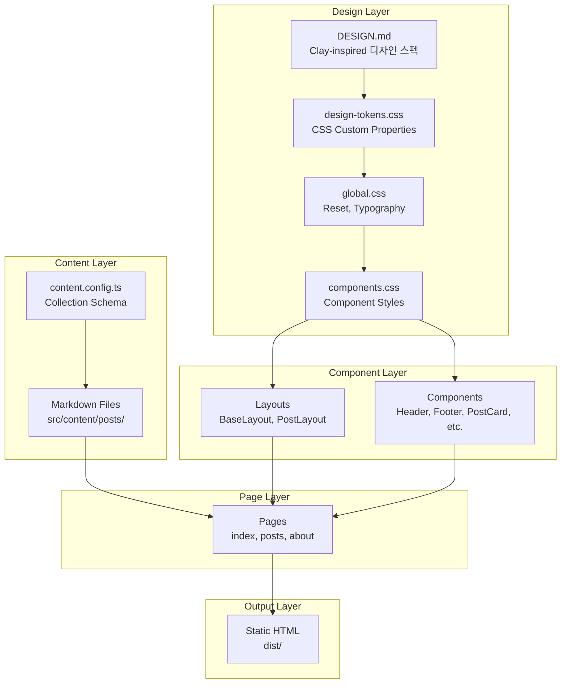

# Architecture Overview

## System Purpose

presence-ego는 에크하르트 톨레의 'A New Earth'에서 영감받은 개인 탐구 블로그입니다. Astro 프레임워크를 활용하여 정적 사이트로 구축되며, Markdown 기반의 Content Collections로 콘텐츠를 관리합니다.

## Architecture Diagram

## Layer Design

### Design Layer

| 파일 | 역할 |
|:---|:---|
| `DESIGN.md` | Clay-inspired 디자인 스펙 |
| `design-tokens.css` | CSS Custom Properties 토큰 |
| `global.css` | CSS 리셋, 타이포그래피, 유틸리티 |
| `components.css` | 버튼, 카드, 폼, 탭 스타일 |

### Content Layer (src/content/posts/)

| 카테고리 | 색상 | 설명 |
|:---|:---|:---|
| reading | brand-pink | 책 리뷰, 인사이트 |
| study | brand-teal | 학습 내용 정리 |
| reflection | brand-lavender | 느낌, 자기 관찰 |
| essay | brand-peach | 자유 형식 글 |

### Component Layer

| 컴포넌트 | 역할 |
|:---|:---|
| `BaseLayout.astro` | HTML 기본 구조, SEO, 폰트 로드 |
| `PostLayout.astro` | 포스트 전용 레이아웃 |
| `Header.astro` | 크림 네비게이션 바 |
| `Footer.astro` | 크림 푸터 (4컬럼) |
| `HeroBand.astro` | 히어로 섹션 (7-5 그리드) |
| `PostCard.astro` | 카테고리별 색상 포스트 카드 |
| `CategoryTabs.astro` | 카테고리 필터 탭 |
| `CtaBand.astro` | CTA 밴드 |
| `BadgePill.astro` | 태그/배지 pill |

### Page Layer

| 페이지 | 라우트 | 설명 |
|:---|:---|:---|
| 홈 | `/` | 히어로 + 최신 포스트 + CTA |
| 글 목록 | `/posts` | 전체 포스트 + 카테고리 필터 |
| 개별 글 | `/posts/[slug]` | 동적 라우트 포스트 |
| 소개 | `/about` | 프로젝트 철학, 카테고리 소개 |

## Technology Decisions

- [ADR-001: Astro 프레임워크 선택과 프로젝트 구조 설계](./adr/001-project-structure.md)
